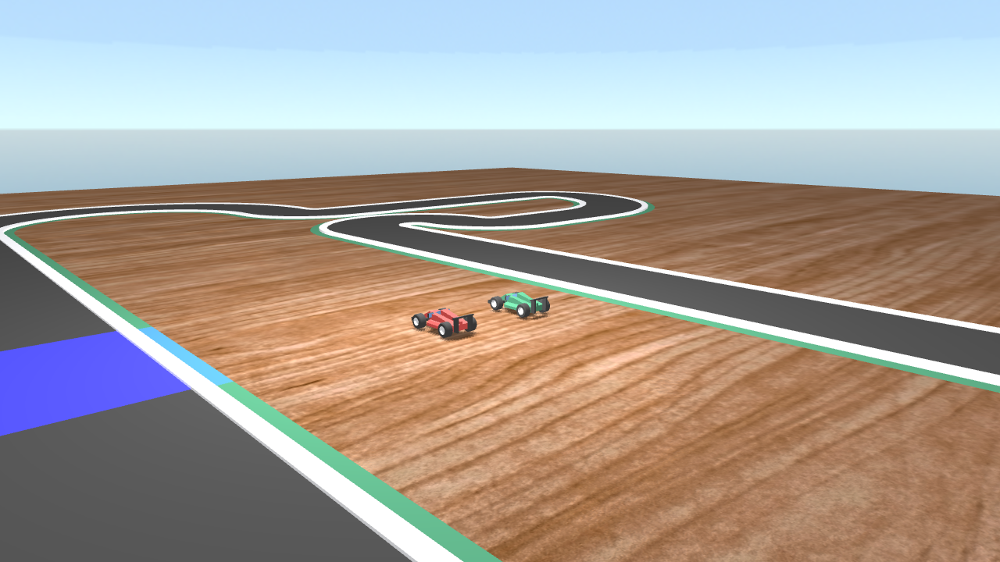

# OpenGL Racing Game Prototype

Features:
- Modern rendering pipeline (GLSL)
- Shadow mapping (with PCB)
- Custom toon shader
- Multiple lights
- Simple rendering engine (OpenGL)
- Simple physics engine (car-road collision tests)
- Custom OBJ / MTL importer
- Built-in tracks editor (serializer included)
- UI with [Nuklear](https://github.com/vurtun/nuklear)
- Joysticks integration
- OpenAL implementation
- Written in C
